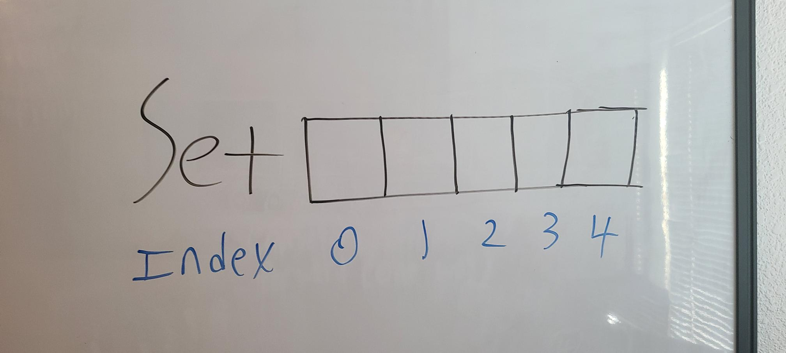
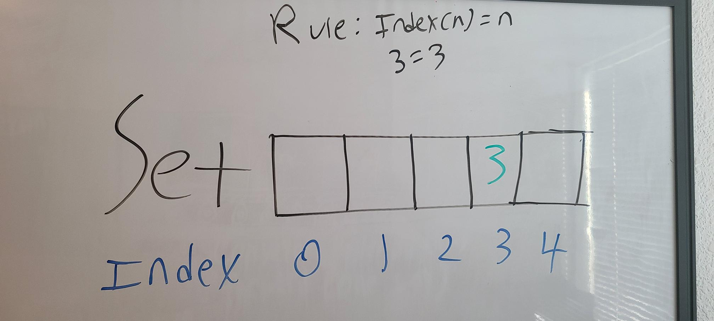
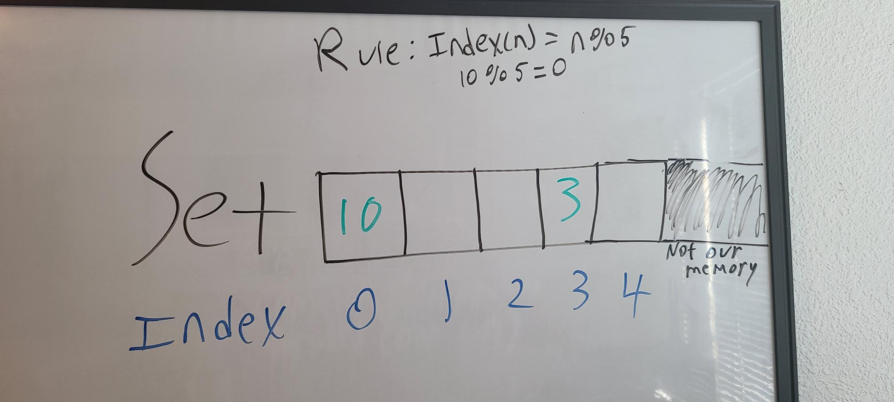
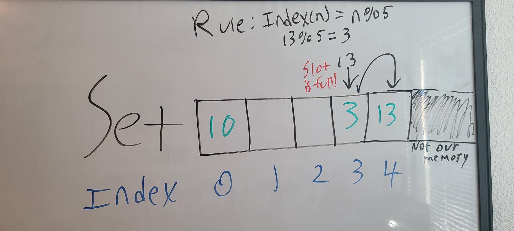
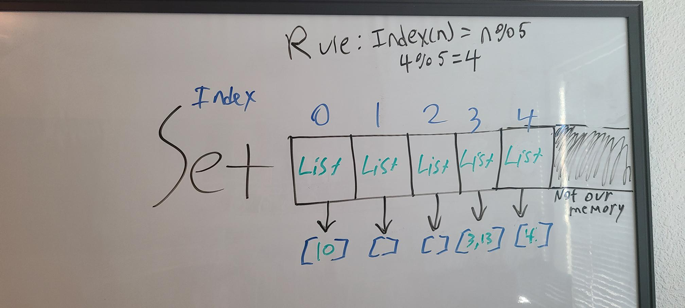

# Queues
## Table of Contents
* Introduction
* Hashing
* Conflicts
* Add/Remove
* Example
* Practice

## Introduction
Most other data structures have rules for what order the data is stored in. This can cause performance issues, however, since to find if something is in one of those structures we need to go over every item in them. What if we wanted to build a data structure where we can add/remove items with O(1) efficiency and determine if something is in it with the same efficiency? We would need to switch the priority. Instead of caring about the order of the data, we'd need to care about the value. Since values are king, we'd also need to disallow duplicates, every value we have must be unique. We call this data structure a **set**. Imagine a set with 5 spots, which looks like this:

If we want to put the number 3 into this set? We could just have a rule that says we put the number into the same spot as itself. I.E. slot(3) = 3 or slot(n) = n for any number.

This could work, and would allow us to instantly determine with O(1) if 3 was in the list. Just check if there's anything in slot 3 and we're done. However, this specific rule isn't very scalable, since we're very quickly going to run out of slots, and we can only store numbers up to as many slots as we have. We couldn't even store the number 5 in this set!

 We need a more complex rule. These rules are called `hash functions`, and the process of applying them to data is called `hashing`.

## Hashing

Python has a built in hash function, `hash()`, which can be applied to any single data type (I.E. numbers, letters, strings, booleans) but not collections or data structures (Lists, queues, sets). This hash is so complex, every time you run `hash()`, even with the same input, you will get different output. Though during the same script session `hash()` is consistent. For example, you might run:
```python
hash(21) #And get
>>>245245245
```
once, but then next time run
```python
hash(21) #And get
>>>1111574654
#But if you run it again in the same session...
hash(21)
>>>1111574654 #Exactly the same!
```

Lets try to build a better hash for our set. A more useable hash function could be slot(n) = n % 5, since that's the number of spaces we have. That means we can now store any number at all in our spaces, so 3 would still go in slot 3, since 3 % 5 = 3, but 10 would go in slot 0, 10 % 5 = 0.  We couldn't store 10 with our old slot(n) = n, since that'd give us an index out of range error.



But this presents us with a new problem. If we tried to put 13 into this set, 13 % 5 = 3, but there's already something in slot 3! We call this a `conflict`.

## Conflicts
A conflict is when two items have the same hash. There are 2 main ways to deal with this:
* Open Addressing
* Chaining

Open addressing is when, if you have a conflict, you just slide the item to the right. So in our 3/13 case we would do this:

This can quickly escalate into back-to-back conflicts however, since now if we tried to add in 4 we would get another conflict.
The alternative, chaining, is to put a list of values in each slot, so we can put multiple items in each one. So our set now looks like this:

Now we know every value would be at its hash index, but just as with open addressing, we've removed our guarantee for O(1) performance, as we need to look through multiple items to tell if something is in the set. 
In both cases, the solution is come up with a better hash algorithm, so it's impossible for multiple items to have the same hash. This is an ongoing effort, and we will probably never have a perfect hash, but current hash algorithms are complex enough for almost every use.

## Add/Remove
To create a new set in Python, we need to use a special function, called a `constructor`, which looks like this

```python
setVariableName = Set()
```

If we wanted to add or remove something from the set, we use the `add(item)` and `remove(item)` functions respectively.
```python
setVariableName.add(10)
>>>{10}
setVariableName.remove(10)
>>>{}
```

Remember that these two will look for the hash of the item and then add to or clear the spot pertaining to that hash. 

Python also has a special function for determining if something is in a set, `member(item)` checks to see if the item is in the set:
```python
setVariableName = {1, 2, 3}
setVariableName.member(2)
>>>True
```

There are also mathematical functions that sets are uniquely suited to perform that Python has built-in functions for.
```python
set1 = {1, 2}
set2 = {2, 3}
set3 = intersection(set1, set2) #Intersection returns only items in both sets, so in this case 2.
>>> {2}
set4 = union(set1, set2) #Union returns a new set with all items in both sets, but without duplicates.
>>> {1, 2, 3}
```
## Example
[Here](./exampleSet.py) we have provided a program for our friend Kevin to keep track of his rock collection. It includes functions for:
* Buying rocks and adding them to the collection
* Selling rocks and removing them from the collection
* Checking to see if a specific rock is in our collection
* and displaying the whole collection.

## Practice
Kevin has asked us to add a new feature to his rock collection program to make it easier to trade rocks at rock-swaps. This new feature must do these things:
* Ask the user what rock to trade away.
* * If we don't own one, exit and let them know
* Ask the user what rock we want to trade for
* * If we already have one, exit and let them know.
* If we own both, remove the traded rock and add the one we traded for
* * Don't forget to say "Trade successful!"
* We don't want unnecessary output, so you can't use the buy or sell functions, since they output things unrelated to trade
* * You're more than welcome to use the own() function though, since it doesn't output anything to the user.

Start with an updated version of the above code that has all of the input done for you [Here](./practiceSet.py)

If you get stuck or finish, check the solution code [Here](./solutionSet.py)
